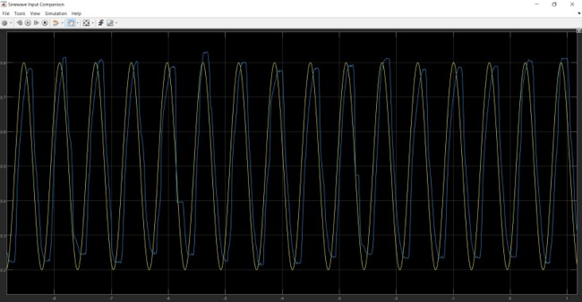

# Robotic Arm Controller
The aim of the project was to create position control over a linear robotic arm; this goal was achieved using a PI controller.

# Steps:
1.	Mapping the potentiometer’s range over the chosen interval [0, 1] using the gain block with the value 1/1024;
2.	Mapping the previous result into a [0, 255] PWM range, using the gain block with the value 127 and the constant block with the value 128;
3.	Building the PI controller: the P component adjusts the position error and the I component integrates the accumulated errors. 

# Results
I chose a Sine Wave Signal as input and I compared it with the current position of the piston. 

